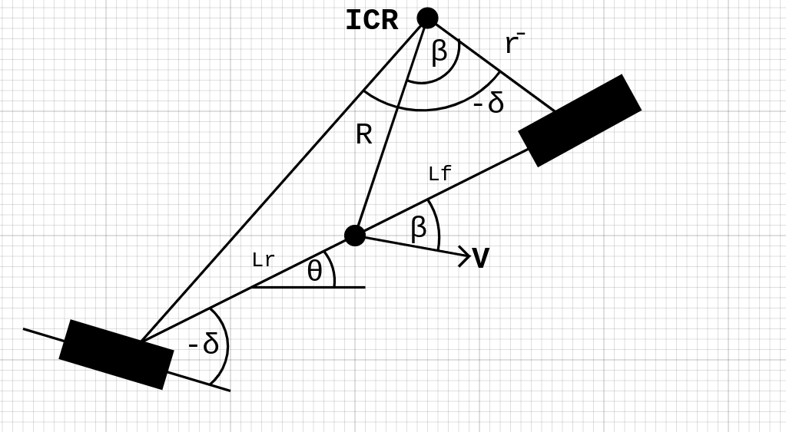

# Kinematic Bicycle Model
In this repository I'll be implemeting the kinematic bicycle model for the 4-Wheel vehicles with front steering and rear steering in Pyhton class Object. And I'm going to test this model by changing different parameters of the vehicle like the steering angle and speed to see how the model will behave in these cases. For the visualization of the output I'll use ROS simulator "turtlesim".

You can find the dimensions of the car (The distance between CG and front wheel, The distance between CG and back wheel) in the "data.yaml" file in config folder.

You can also find launch file for both front and rear steering cases.

So, Let's start.

- ## Front Steering
Starting with the front steering model We will consider the point to be analyzed on the vehicle is at its center of gravity.
Knowing that all point on the vehicle moves about the Instantaneous Center of Rotation ( ICR ).

In the image above you can find the geometry of the model which I relied on to derive all the following equations.

### Model Equations:
#### $V_x$ = $vcos{(\theta + \beta)}$
#### $V_y$ = $vsin{(\theta + \beta)}$
### $\dot{\theta}$ = $v cos(\beta)tan(\delta) \over L $
### $\beta  =$ $tan^-1($ $l_r tan(\delta) \over L$ $)$
### Model Inputs:
- Steering angle $\delta$
- Vehicle velocity $v$
- time of simulation $t$
- $l_r$ from yaml file

### Simulation
- velocity = 5
- steering angle = 30 $degrees$
- simulation time = 5 $seconds$
Video:

#### Decaing Steering angle
here I added a new feature to me model where the steering angle is not constant instead it's deacing with time until it gets to zero and the vehicle moves in straight line.
Video:

- ## Rear Steering
Rear steering is the same like front steering but the difference is that the rear wheels are the moving ones. 

#### $V_x$ = $vcos{(\beta - \theta)}$
#### $V_y$ = $vsin{(\beta - \theta)}$
### $\dot{\theta}$ = $(-v cos(\beta)tan(\delta)) \over L $
#### $\beta  =$ $tan^-1($ $-l_f tan(\delta) \over L$ $)$
